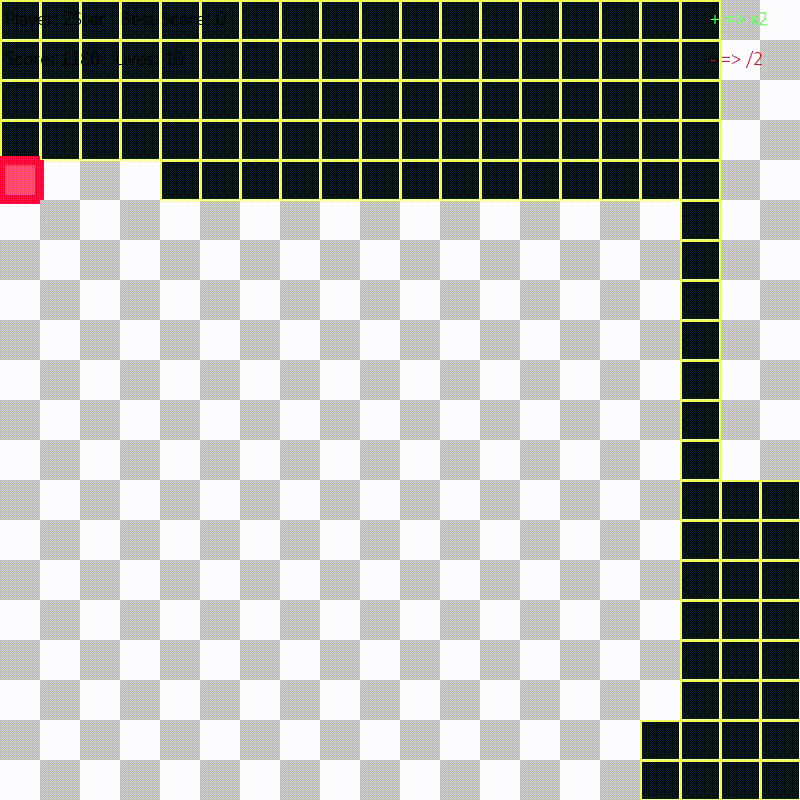

# Snake-for-AI
A Snake game I made for implementing artificial intelligences  in Python.

# Demo:

# Adding a bot

To add a bot, create a bot file in the 'bots' folder (just like "RandomAI.py").
It has to implement the class Player. 
The game asks for a direction to take to the player (check the Directions class).
Your bot has to return a Direction (through the 'decision(self, grid, snake, apple)' function).
To make your decisions, you can use the members of the grid, the snake, and the apple.
You also need to add your bot in the 'load_boats(self)' function in the BotLoader class.

# Useful parameters for decision making

Useful members of the grid:
 - size: an integer (the grid is a size*size square)

Useful members of the snake:
 - body: a tuple list that represents the snake's position (the head of the snake is the first element)
 - direction: a tuple (the direction the snake is heading to)

Useful members of the apple:
 - position: a tuple indicating the position of the apple

